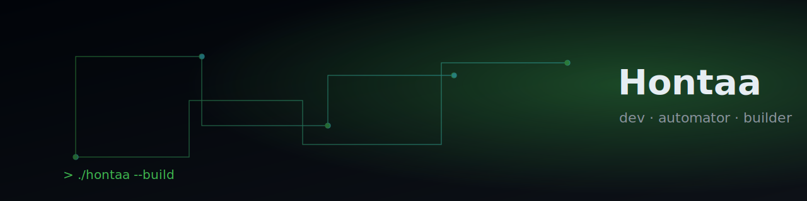

  

<h1 align="center">Hontaa</h1>

<i>dev · automator · builder</i>

  
  
  

---

## 👋 About

I build **self-running software** — tools and agents that work without hand-holding. Currently focused on:

- **Micro-SaaS** from first principles (OSS core → paid layer)
- **Quant / trading** research (scientific, evidence-first)
- **Roblox** tycoon projects (SpaceTycoon)
- **Windows automation** & AI agents

> No fake-green. Every claim backed by a real tool run.

## 🚀 Featured

| Project | What |
|---|---|
| [envguard](https://github.com/Hontaa/envguard) | Python-native `.env` / config validator — schema check, secret-leak scan, drift diff |
| [SpaceTycoon](https://github.com/Hontaa) | Roblox tycoon (private WIP) |

## 🧰 Stack

`Python` · `FastAPI` · `Luau/Roblox` · `Playwright` · `PostgreSQL` · `Docker` · `Hermes Agent`

## 📫

Reachable via GitHub. No DMs for "let's chat" — read the code first.
